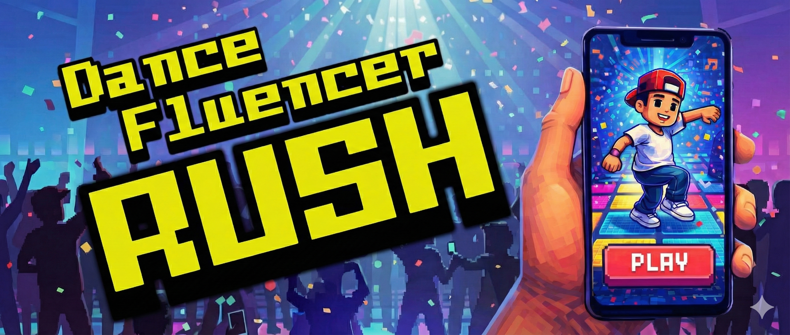
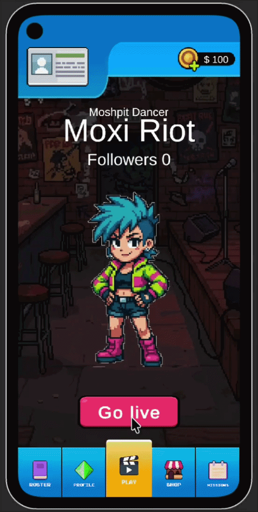
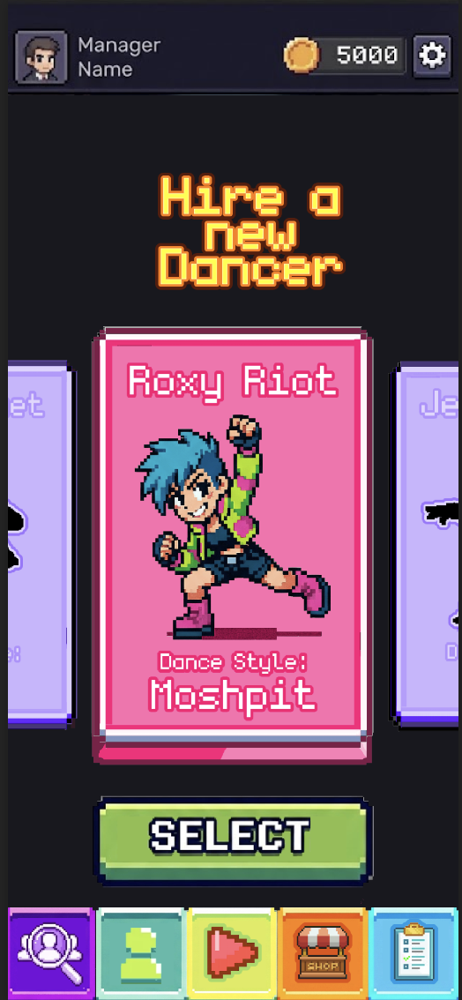
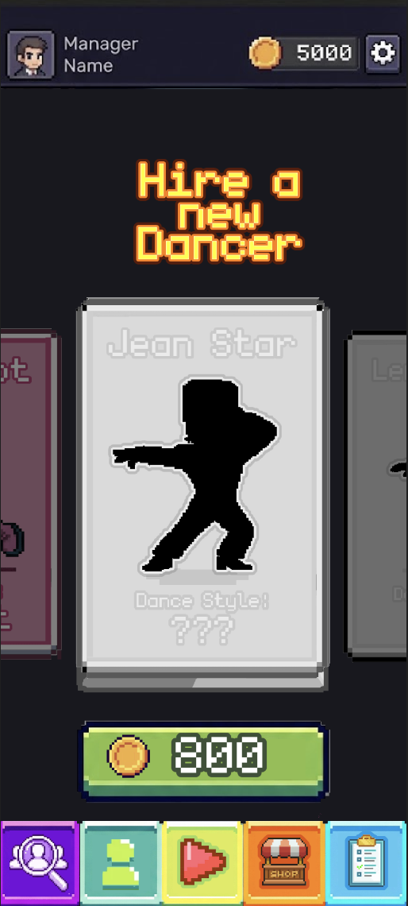
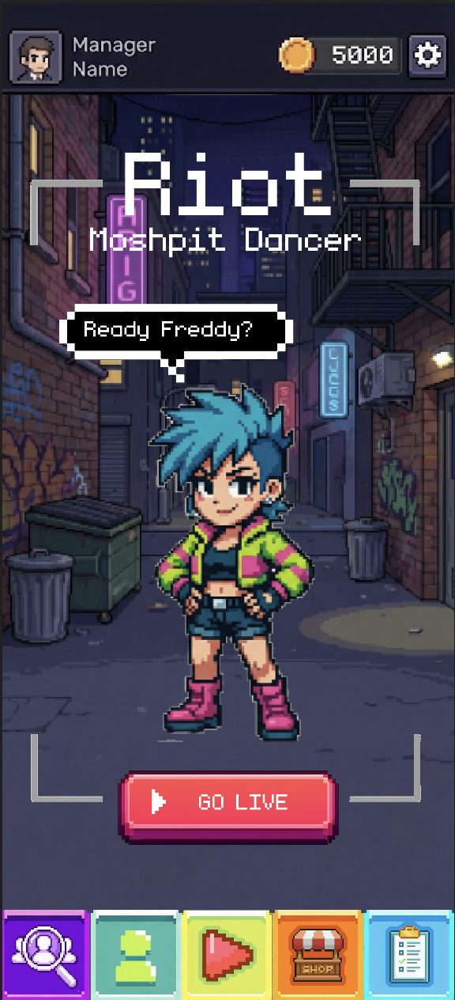
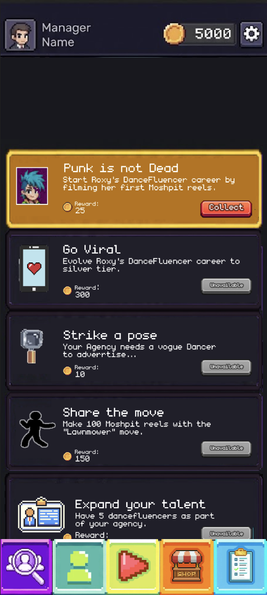

<h1 id="dancefluencer-rush" style="font-size: 50px; border-bottom: none;" align="center">Dancefluencer Rush</h1>

 

[About](#about)  · [Current project status](#current-project-status) · [Running the project](#running-the-project) · [Future project vision](#future-game-vision)

 

# About

  Dancefluencer Rush is a Unity hyper-casual arcade-style mobile game that simulates the fast-paced content creation process of TikTok dance influencers. It takes inspiration from classic games like `Dance Dance Revolution`, `Just Dance` and `Osu!` but steps away from the rhythm genre to focus mainly how many moves replicated under a time limit.
  The faster you replicate moves, the more content you churn out to stay relevant, evolve your style and grow your fanbase.

  

   
  
<a href="#dancefluencer-rush">↑ Return to top</a>

 

# Current project status
The current build delivers the main gameplay loop alongside a simple progression and character unlocking system:
the player has to perform a sequence of directional inputs to fill a score bar and complete as many rounds as possible before the timer runs out. This concept is meant to simulate a dance influencer creating short-form content, where each round represents recording a new reel and faster input completion allows the player to produce more reels before the time limit is depleted.

The features below can also be previewed on [this youtube video](https://bit.ly/jslusark_dancefluencer)

### Core Systems & Features

- **Core Gameplay Loop:** The player must match a randomly generated set of directional inputs to fill a score bar and advance the round counter. The goal is to complete as many rounds as possible before the timer runs out.

- **Scoring System:** Each completed set of inputs fills the video bar based on the character's power, which scales with their experience level. Power decreases after each round, following a clicker-game decay mechanic where early rounds are easier to complete, but returns diminish over time.

- **Coin Collection System:** throughout the core game loop, coins dynamically spawn on the screen at timed intervals throughout the core game loop and can be collected with a simple tap. The coins collected during a session contribute to the player's in-game currency, however they also introduce a risk-reward element as they can distract the player from completing the sets of directional inputs required to advance rounds. 

- **Input:** Supports mobile input as the game reads directional swipes and taps. On desktop, arrow keys and mouse clicks are completely supported through Unity's Input System.

- **Character Roster:** Features three playable characters, each with a distinct dance style, pose set, and visual identity.

- **Character Unlocking:** Characters are unlocked by spending in-game currency, which is earned during gameplay or topped up on demand from the top-up menu bar.

- **Session Summary:** At the end of each session, results are displayed and written to the character's profile, updating their follower count and the player's overall wallet balance.

- **Interactive Feedback:** Every player interaction triggers responsive sprite changes, animations, and audio cues.

### Technical Architecture & UI

- **Platform:** Builds and runs as an Android APK on real devices with no additional configuration required.

- **Responsive UI:** Layouts adapt dynamically to portrait mode across common mobile aspect ratios (with a focus on iPhones and Pixel devices).

- **Menu and Screen Navigation:** Menu buttons and in-game events trigger panel visibility changes and clean scene transitions.

- **Save System:** Player progress and wallet balance are serialized to a JSON file and saved on pause and quit, persisting across sessions. When reopening the game, players continue exactly from where they left off with their progress fully intact.

- **ScriptableObject Configs:** Character's immutable data such as sprites, audio, unlock cost, and animation data are stored in ScriptableObjects, allowing for easy tweaking and expansion.

- **MVC Architecture:** The project follows a Model-View-Controller pattern for most of its core systems, ensuring a clean separation of concerns and maintainable codebase.

- **Built to Scale:** While hypercasual in scope, the project is architecturally designed with hybrid-casual expansion in mind. Character progression through follower count, a missions system and cosmetic customization are all accounted for structurally, leaving clear room to grow. Placeholder panels were left for these features for futute development.

 

<a href="#dancefluencer-rush">↑ Return to top</a>

 

# Running the project
Follow these steps to open and play the current build in the Unity Editor.

**Prerequisites:**
* Ensure you have `Unity 6000.3.9f1` installed via Unity Hub.
* Install the `Android` build support modules if you plan to build to a device.

**How to run the project:**
1. Clone or download this repository to your local machine.
2. Open Unity Hub, click **Add**, and select the `Dancefluencer Rush` project folder.
3. Open the project.
4. In the Project window, navigate to the Scenes folder: `Assets/Scenes/`.
5. Double-click on `Game` to load it.
6. Press the `Play` button at the top of the Unity Editor to test the game. 

> When you first open the project, text may be invisible and Unity may default to the PC platform.   To run this correctly, please go to `Window` > `TextMeshPro` > `Import TMP Essential Resources`, then go to `File` > `Build Settings`, select `Android`, and click `Switch Platform` to play the game with its intended text, size, and orientation.

**Controls in Editor:**
- Use the mouse to navigate menus and select characters.
- In the play screen, use arrow keys to simulate mobile swipes and play the game.

 

<a href="#dancefluencer-rush">↑ Return to top</a>

 

# Future Game Vision
The game is planned to expand toward a hybrid-casual model, where the core arcade loop is wrapped in a meta-layer that adds long-term progression through subtle simulation mechanics.

In this extended version, the player would function as an influencer manager who unlocks dancing talents and evolves them into icons by:
- Completing missions to advance their careers.
- Strategically purchasing items to boost video performance.
- Playing arcade sessions to continuously grow a dancer’s follower base, experience, and recognition.

### - Preview concept images - 

 

> **Image Source Note:** The game's visuals come from are a mix of free assets, AI-generated images that were manually modified and original images designed by the project author.

 

<a href="#dancefluencer-rush">↑ Return to top</a>

