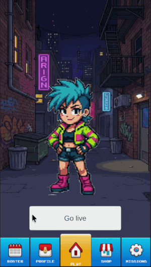
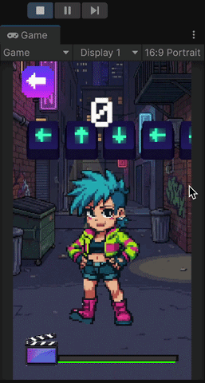
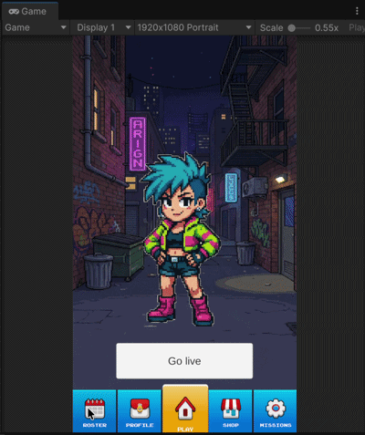

<h1 id="dancefluencer-rush" style="font-size: 50px; border-bottom: none;" align="center">Dancefluencer Rush</h1>

 

[About](#about)  · [Current project status](#current-project-status) · [Running the project](#running-the-project) · [Future project vision](#future-game-vision)

 

# About

  Dancefluencer Rush is a Unity hyper-casual arcade-style mobile game that simulates the fast-paced content creation process of TikTok dance influencers. It takes inspiration from classic games like `Dance Dance Revolution`, `Just Dance` and `Osu!` but steps away from the rhythm genre to focus mainly how many moves replicated under a time limit.
  The faster you replicate moves, the more content you churn out to stay relevant, evolve your style and grow your fanbase.

   
  
<a href="#dancefluencer-rush">↑ Return to top</a>

 

# Current project status
The current build focuses on the core gameplay loop: the player has to perform a sequence of directional inputs to fill a score bar and complete as many rounds as possible before the timer runs out. This concept is meant to simulate a dance influencer creating short-form content, where each round represents recording a new reel and faster input completion allows the player to produce more reels before the time limit is depleted.

### Features:
- **Menu and Screen Navigation:** The game supports menu-based transitions across game screens and states.
- **Character Selection:** Players can play as different dancers, each with their own high score to beat.
- **Sequence-Based Input Challenge:** Players use arrow keys to match directional prompts, with each move validated as success or fail. The arrow sequence is generated randomly for each round, success moves fill the score bar while failed moves deplete it.
- **Time-Based Gameplay:** Players have a limited time to complete as many rounds as possible, with the game ending when the timer runs out.
- **Mobile UI Scaling:** UI layouts are configured to scale across different device sizes in most screens (portrait orientation only).

 

<a href="#dancefluencer-rush">↑ Return to top</a>

 

# Running the project
Follow these steps to open and play the current build in the Unity Editor.

**Prerequisites:**
* Ensure you have `Unity 6000.3.9f1` installed via Unity Hub.
* Install the `Android` build support modules if you plan to build to a device.

**How to run the project:**
1. Clone or download this repository to your local machine.
2. Open Unity Hub, click **Add**, and select the `Dancefluencer Rush` project folder.
3. Open the project.
4. In the Project window, navigate to the Scenes folder: `Assets/Scenes/`.
5. Double-click on `Game` to load it.
6. Press the `Play` button at the top of the Unity Editor to test the game. 

> When you first open the project, Unity may default to the PC/Standalone platform. To run this correctly, please go to `File > Build Settings`, select Android under the Platforms list, and click `Switch Platform` to be able to play the game in it's intended size and orientation.

**Controls in Editor:**
- Use the mouse to navigate menus and select characters.
- In the play screen, use arrow keys to simulate mobile swipes and play the game.

 

<a href="#dancefluencer-rush">↑ Return to top</a>

 

# Future Game Vision
The game is planned to expand toward a hybrid-casual model, where the core arcade loop is wrapped in a meta-layer that adds long-term progression through subtle simulation mechanics.

In this extended version, the player would function as an influencer manager who unlocks dancing talents and evolves them into icons by:
- Completing missions to advance their careers.
- Strategically purchasing items to boost video performance.
- Playing arcade sessions to continuously grow a dancer’s follower base, experience, and recognition.

### - Preview concept images - 

 

> **Image Source Note:** The game's visuals come from are a mix of free assets, AI-generated images that were manually modified and original images designed by the project author.

 

<a href="#dancefluencer-rush">↑ Return to top</a>

